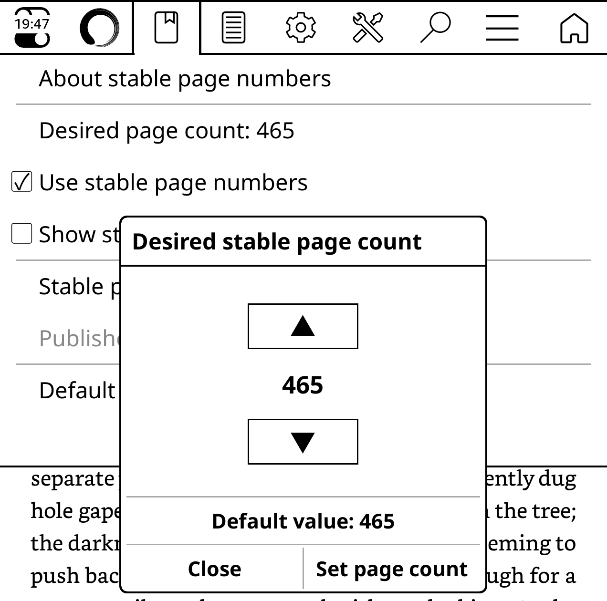

# KOReader Stable Page Count

A KOReader plugin that lets you choose the stable page count you want instead of choosing an abstract number of characters per page.

The plugin replaces KOReader's **Characters per page** control with **Desired page count**. It tests KOReader's native synthetic page-map values, chooses the closest result, and leaves the native stable-page system responsible for page labels, navigation, bookmarks, and status information.



## Status

Early development version. It currently supports reflowable documents handled by KOReader's CREngine, such as EPUB books.

## Install with ZenPM

Add the following custom source in [ZenPM](https://github.com/xZenLabs/zen-pm)'s **Sources** screen:

```text
https://zenpm.treetrum.com/
```

Refresh the catalog, then install **Stable Page Count**.

## Install with KOReader AppStore

In the [KOReader AppStore](https://github.com/omer-faruq/appstore.koplugin), search for **Stable Page Count** and install it.

## Install manually on a KOReader device

1. Download the plugin ZIP from the latest GitHub release and extract it, or clone this repository.
2. Copy the entire `pagecount.koplugin` directory into KOReader's `plugins` directory.
3. Restart KOReader.
4. If necessary, enable **Stable page count** in KOReader's plugin manager and restart again.
5. Open a reflowable book and open its **Stable page numbers** menu.
6. Choose **Desired page count**, enter a number, and press **Set page count**.

The final directory on the device must look like this:

```text
koreader/
└── plugins/
    └── pagecount.koplugin/
        ├── _meta.lua
        ├── main.lua
        └── pagecount.lua
```

## How it works

KOReader creates synthetic stable pages from a characters-per-page value. This plugin performs a binary search between KOReader's native 500–3000 character limits and rebuilds the synthetic page map with the best value it finds.

EPUB files are split into internal HTML fragments, and KOReader starts at least one stable page for each fragment. Consequently, some exact page counts are impossible. In that case the plugin reports and applies the closest available count.

The page-count dialog shows the count produced by KOReader's 1500-characters-per-page default as its default value. Publisher-provided page numbers remain available through **Use publisher page numbers**.

## Releases

Release Please maintains the changelog, version tags, and GitHub releases from conventional commits. Merging a Release Please PR also attaches an installable `pagecount.koplugin.zip` containing `pagecount.koplugin` to the release.

## Development

Run the calculation tests with:

```sh
lua tests/pagecount_spec.lua
```

Testing the complete UI requires running KOReader or installing the plugin on a device because the UI modules are supplied by KOReader itself.
